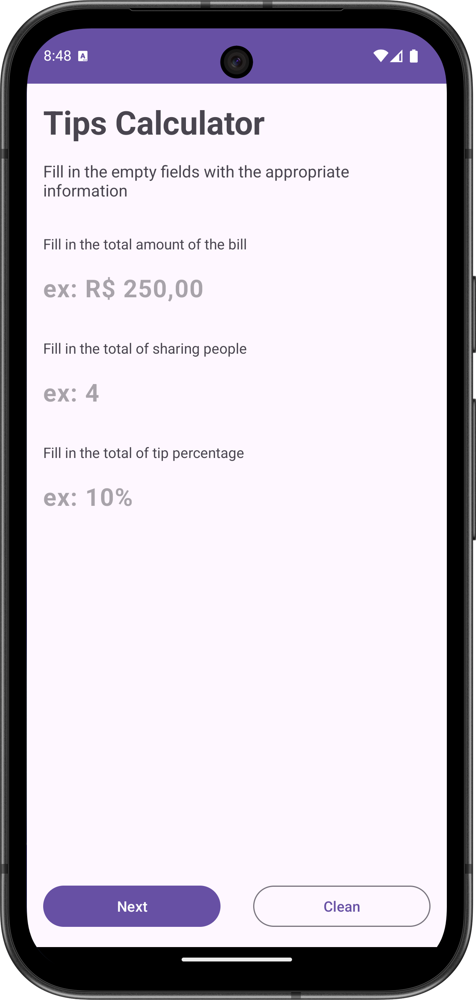
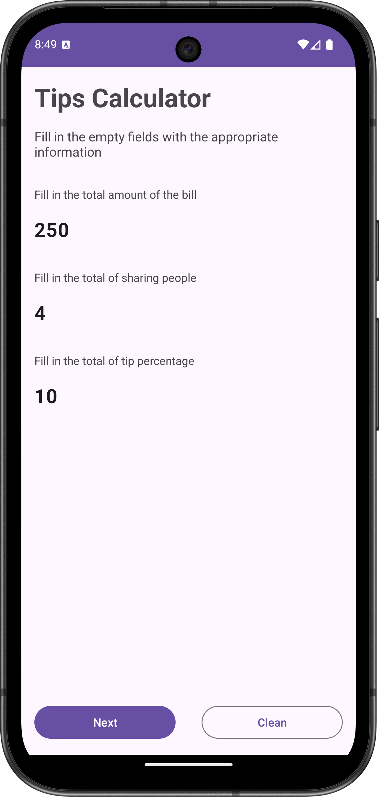
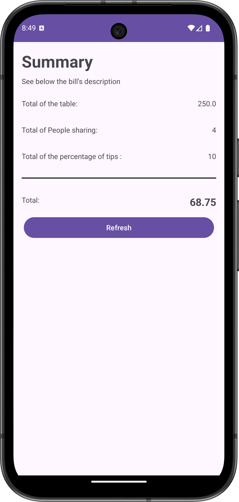

# 💸 Tips Calculator

**Tips Calculator** is an Android app built with **Kotlin** that helps you calculate the **tip amount** and the **total bill** based on a tip percentage and the bill value.  
This project focuses on **input validation**, correct **currency formatting**, and a smooth, user-friendly calculation flow.

---

## 🧭 Overview

With Tips Calculator you can:

- Enter the **bill amount**
- Select a **tip percentage** (or input a custom percentage, depending on implementation)
- View the calculated:
  - **Tip amount**
  - **Total amount** (bill + tip)
- Get immediate feedback for invalid inputs

---

## ✨ Features

- ✅ Tip calculation based on bill value and percentage  
- ✅ Input validation (empty values, invalid numbers, edge cases)  
- ✅ Currency/number formatting for better readability  
- ✅ Simple and intuitive user flow  

---

## ⚙️ Technologies

- **Language:** Kotlin  
- **UI:** XML Views  
- **Android Components:** Activities / Fragments *(as used in the project)*  
- **Concepts Practiced:** validation, formatting, clean UI flow  

---

## 🧪 Notes

- All calculations are performed locally (no external API).
- Optional improvements:
  - Split total per person
  - Preset tip buttons (10% / 15% / 20%)
  - Save/share the result

---

## 📸 Screenshots

  
